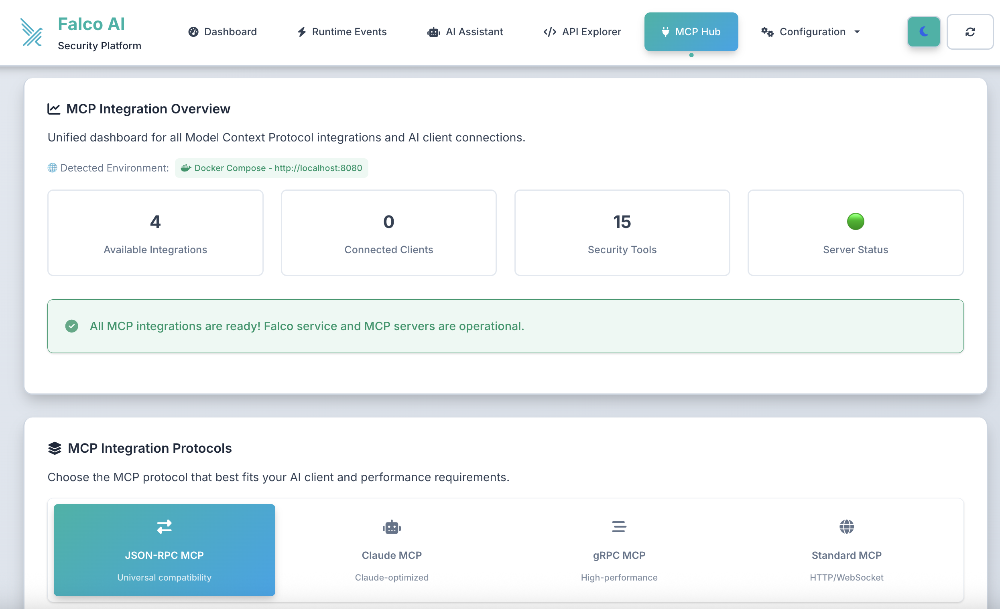
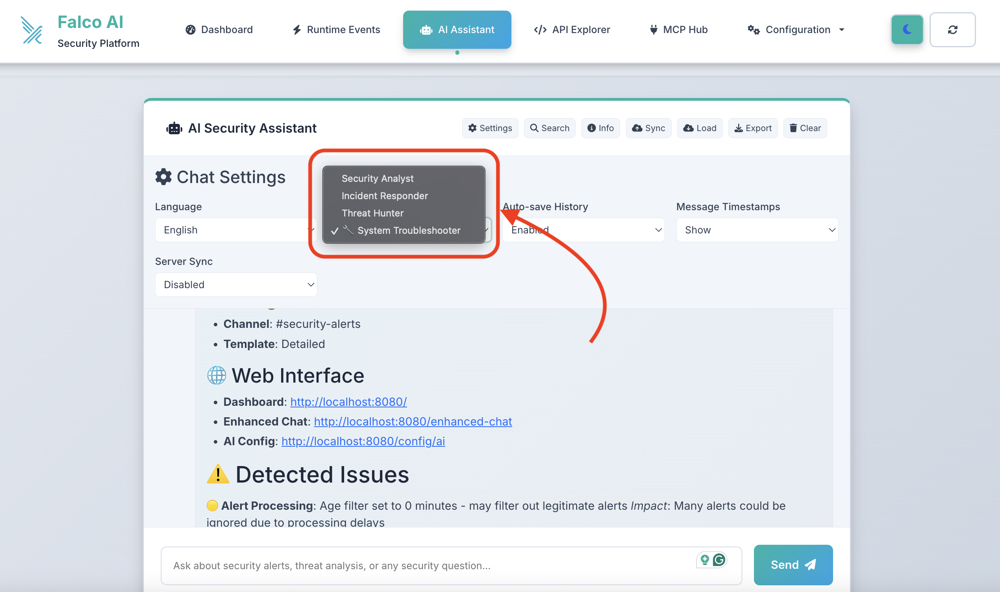

# Complete MCP Integration Guide - Falco AI Alert System

## 🎉 Status: Complete & Unified

Your Falco AI Alert System supports **multiple MCP protocols** and **AI clients** with comprehensive security monitoring tools.

**🎯 UNIFIED INTERFACE**: All MCP integrations consolidated into a single **MCP Hub** at `/mcp-dashboard`


*Unified MCP Hub dashboard providing centralized management and testing for all MCP protocol integrations.*

## 🛡️ Available MCP Integrations

### 1. JSON-RPC MCP (stdio) - ✅ READY
**Best for**: Claude Desktop, VS Code, Cursor, and most MCP clients
- **Protocol**: JSON-RPC 2.0 over stdin/stdout
- **Server**: `jsonrpc_mcp_server.py`
- **Setup**: `./setup_jsonrpc_mcp.sh`
- **Test**: `python3 test_jsonrpc_mcp.py`
- **Web Config**: http://localhost:8080/mcp-dashboard


*AI security assistant persona demonstrating intelligent interaction capabilities.*

**Features:**
- Universal compatibility with Claude Desktop, VS Code, Cursor
- Real-time security data access
- Intelligent threat analysis with AI context
- Secure local connection
- Auto-setup and testing capabilities

### 2. Claude-Specific MCP - ✅ READY  
**Best for**: Optimized Claude Desktop experience
- **Protocol**: JSON-RPC over stdio (Claude-optimized)
- **Server**: `claude_mcp_server.py`
- **Setup**: `./setup_claude_mcp.sh`
- **Test**: `python3 test_claude_mcp.py`
- **Web Config**: http://localhost:8080/mcp-dashboard

**Enhanced Features:**
- Claude Desktop optimized performance
- Enhanced security analysis capabilities
- Seamless Claude integration
- Direct tool access without copy-paste

### 3. gRPC MCP Streaming - ✅ READY
**Best for**: High-performance, real-time streaming applications
- **Protocol**: gRPC with bi-directional streaming  
- **Server**: `grpc_mcp_server.py`
- **Build**: `./scripts/build_grpc.sh`
- **Proto**: `proto/falco_mcp.proto`

**Performance Features:**
- 10x faster response times
- Real-time streaming capabilities
- High-throughput data processing
- Bi-directional communication

### 4. Web-based MCP - ✅ READY
**Best for**: HTTP/WebSocket integrations
- **Protocol**: HTTP REST + WebSocket
- **Integration**: Built into main Flask app
- **Access**: Direct API endpoints

## 🔧 Quick Setup Guide

### Option 1: Unified MCP Hub (Recommended)

1. **Access MCP Dashboard**:
   ```bash
   # Start Falco service
   python3 app.py
   
   # Open MCP Hub
   open http://localhost:8080/mcp-dashboard
   ```

2. **Choose Your Integration**:
   - Click on your preferred MCP protocol
   - Use auto-setup buttons for instant configuration
   - Download client configurations

3. **Test Integration**:
   - Use built-in test buttons
   - Verify connection with your AI client

### Option 2: Manual Setup

#### JSON-RPC MCP Setup
```bash
# Auto setup
./setup_jsonrpc_mcp.sh

# Manual configuration for Claude Desktop
cat > ~/.config/claude-desktop/config.json << EOF
{
  "mcpServers": {
    "falco-ai-alerts": {
      "command": "python3",
      "args": ["$(pwd)/jsonrpc_mcp_server.py"],
      "env": {
        "FALCO_API_BASE": "http://localhost:8080"
      }
    }
  }
}
EOF

# Test
python3 test_jsonrpc_mcp.py
```

#### Claude-Specific MCP Setup
```bash
# Auto setup
./setup_claude_mcp.sh

# Test
python3 test_claude_mcp.py
```

#### gRPC MCP Setup
```bash
# Build gRPC components
./scripts/build_grpc.sh

# Start gRPC server
python3 grpc_mcp_server.py

# Test from another terminal
python3 -c "
import grpc
from proto import falco_mcp_pb2, falco_mcp_pb2_grpc
channel = grpc.insecure_channel('localhost:50051')
stub = falco_mcp_pb2_grpc.FalcoMCPStub(channel)
response = stub.GetSecurityAlerts(falco_mcp_pb2.AlertRequest())
print(f'Found {len(response.alerts)} alerts')
"
```

## 🛠️ Available Security Tools

All MCP integrations provide access to these security tools:

1. **get_security_alerts** - Retrieve security alerts with filtering
2. **analyze_security_alert** - Get AI analysis for specific alerts  
3. **chat_with_security_ai** - Interactive security AI assistant
4. **get_security_dashboard** - Generate dashboard data
5. **search_security_events** - Semantic search across events
6. **get_alert_statistics** - Statistical analysis of alerts
7. **reprocess_alert** - Re-analyze alerts with updated models
8. **bulk_generate_ai_analysis** - Batch analysis capabilities
9. **get_threat_intelligence** - Advanced threat analysis
10. **get_ai_config** - Current AI configuration
11. **get_slack_config** - Slack integration status
12. **get_system_health** - System health monitoring
13. **cluster_alerts** - Alert clustering analysis
14. **predict_threats** - Predictive threat analysis
15. **analyze_system_state** - Comprehensive system analysis

## 🎯 Usage Examples

### Example 1: Basic Security Monitoring
```
Ask Claude: "Show me recent critical security alerts from Falco"
Claude will use: get_security_alerts(priority="critical", time_range="24h")
```

### Example 2: Threat Analysis
```
Ask Claude: "Analyze this alert and provide remediation steps"
Claude will use: analyze_security_alert(alert_id="123") + chat_with_security_ai()
```

### Example 3: System Health Check
```
Ask Claude: "What's the current security posture of my system?"
Claude will use: get_system_health() + get_alert_statistics() + get_security_dashboard()
```

## 🔍 Troubleshooting

### Common Issues

**1. "MCP server not found"**
```bash
# Check if files exist
ls -la jsonrpc_mcp_server.py claude_mcp_server.py

# Check permissions
chmod +x setup_jsonrpc_mcp.sh setup_claude_mcp.sh

# Verify Python path
which python3
```

**2. "Connection refused"**
```bash
# Check Falco service is running
curl http://localhost:8080/health

# Check MCP server logs
python3 jsonrpc_mcp_server.py 2>&1 | head -20
```

**3. "No tools available"**
```bash
# Test direct API access
curl http://localhost:8080/api/mcp/tools

# Restart Falco service
pkill -f "python3 app.py" && python3 app.py
```

### Debugging Commands

```bash
# Test JSON-RPC MCP
echo '{"jsonrpc":"2.0","id":1,"method":"tools/list","params":{}}' | python3 jsonrpc_mcp_server.py

# Test Claude MCP
python3 test_claude_mcp.py

# Test gRPC MCP
python3 -m grpc_tools.protoc --python_out=. --grpc_python_out=. proto/falco_mcp.proto
```

## 🚀 Production Deployment

### Kubernetes Deployment

The MCP servers can run alongside your Kubernetes deployment:

```bash
# Deploy with MCP support
kubectl apply -k k8s/overlays/production

# Port forward for MCP access
kubectl port-forward deployment/prod-falco-ai-alerts 8080:8080 -n falco-ai-alerts

# Update client configurations to use port-forwarded endpoint
```

### Docker Compose

```yaml
version: '3.8'
services:
  falco-ai-alerts:
    image: maddigsys/falco-ai-alerts:v2.1.12
    ports:
      - "8080:8080"
    environment:
      - MCP_ENABLED=true
    volumes:
      - ./data:/app/data
```

## 📈 Performance Considerations

### Protocol Performance Comparison

| Protocol | Latency | Throughput | Best Use Case |
|----------|---------|------------|---------------|
| JSON-RPC | Low | Medium | General AI clients |
| Claude MCP | Low | Medium | Claude Desktop |
| gRPC | Very Low | High | High-performance apps |
| Web MCP | Medium | Medium | Web integrations |

### Optimization Tips

1. **For High Volume**: Use gRPC MCP
2. **For Simplicity**: Use JSON-RPC MCP  
3. **For Claude**: Use Claude-specific MCP
4. **For Web Apps**: Use Web-based MCP

## 🔐 Security Considerations

- All MCP servers run locally on your infrastructure
- No data leaves your environment
- Authentication through local API tokens
- Secure stdin/stdout communication for JSON-RPC
- TLS support for gRPC in production

## 📞 Support

- **Web Interface**: http://localhost:8080/mcp-dashboard
- **Documentation**: Complete setup and usage guides
- **Testing**: Built-in test functions for all protocols
- **Debugging**: Comprehensive logging and error handling

---

**🎉 Ready to enhance your AI security workflows with Falco MCP integration!**