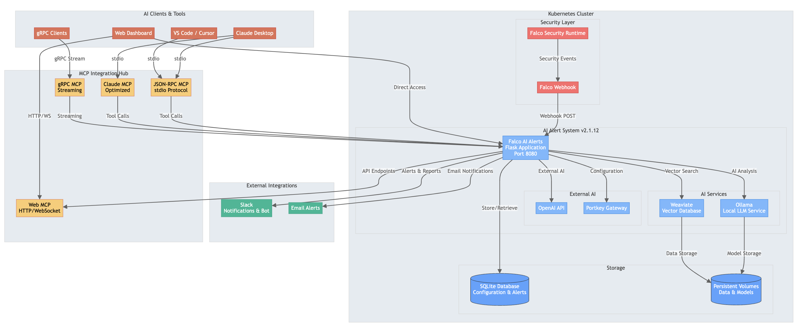

# Kubernetes Deployment - Falco Vanguard v2.1.12

> **🚀 One-Command Deployment**: `cd k8s && ./install-dynamic.sh`

This comprehensive Kubernetes deployment provides AI-enhanced security alerting with automatic platform detection and optimization.


*Kubernetes deployment architecture showing the complete AI-enhanced security alerting system.*

## ✨ What's New in v2.1.12

### **🛠 Enhanced Configuration System**
- **Comprehensive AI Config Responses**: Ask "what is my AI configuration?" for detailed setup information
- **Fixed Slack Configuration Loading**: Status now loads properly on `/config/slack`
- **Automatic Issue Detection**: Smart troubleshooting with "apply fix [number]" commands
- **Age Filter Fix**: Resolved alert filtering issues with automatic detection

### **🤖 Enhanced AI Features**
- **Enhanced Chat Interface**: Multi-persona AI chat with troubleshooting assistant
- **Configuration Troubleshooter**: Built-in system diagnostics and automatic fixes
- **Improved Response Quality**: Better configuration summaries and help responses

## 📋 Prerequisites

### **Kubernetes Requirements**
- **Version**: 1.19+ 
- **Nodes**: Minimum 8GB RAM per node
- **Storage**: Default StorageClass or SSD storage
- **Add-ons**: Metrics Server, Ingress Controller (recommended)

### **Resource Requirements**
| Environment | Memory | CPU | Storage | Model |
|-------------|--------|-----|---------|-------|
| **Development** | 8GB | 2 cores | 15GB | `phi3:mini` |
| **Production** | 10GB | 4 cores | 20GB | `llama3.1:8b` |
| **Enterprise** | 18GB+ | 8+ cores | 30GB+ | `whiterabbit-neo` |

## 🚀 Quick Start

### **Automatic Deployment** (Recommended)
```bash
# Clone repository
git clone <repository-url>
cd falco-rag-ai-gateway/k8s

# Deploy with auto-detection
./install-dynamic.sh

# Deploy with specific environment
./install-dynamic.sh --environment production
```

### **Manual Deployment**
```bash
# Deploy base manifests
kubectl apply -f base/

# Deploy with environment overlay
kubectl apply -k overlays/production/
```

## 🌐 Supported Platforms

### **Cloud Platforms** (Auto-Detected)
- ✅ **AWS EKS** - Graviton2/3 ARM64 optimization
- ✅ **Google GKE** - Tau T2A ARM64 cost savings (20-40%)
- ✅ **Azure AKS** - Ampere ARM64 instances
- ✅ **DigitalOcean** - SSD storage optimization
- ✅ **IBM Cloud** - Multi-zone configuration

### **Local Platforms** (Auto-Detected)
- ✅ **minikube** - Single-node development
- ✅ **kind** - Local testing clusters
- ✅ **k3s** - Lightweight Kubernetes
- ✅ **Docker Desktop** - Local development

## 📦 Architecture

### **Core Components**
- **falco-ai-alerts**: Main application (`maddigsys/falco-ai-alerts:v2.1.12`)
- **ollama**: Local LLM service for AI analysis
- **weaviate**: Vector database for enhanced search

### **Optional Components**
- **NGINX Ingress**: Load balancer and SSL termination
- **Cert-Manager**: Automatic TLS certificates
- **Prometheus**: Metrics and monitoring

### **Available Overlays**
```
k8s/overlays/
├── development/     # Single replica, debug enabled
├── production/      # HPA, network policies, monitoring
├── eks/            # AWS EKS optimized configuration
├── gke/            # Google GKE optimized configuration
└── aks/            # Azure AKS optimized configuration
```

## 🔗 Access Your Application

### **Production Access** (with Ingress)
- **Main Dashboard**: `https://your-domain.com/`
- **Enhanced Chat**: `https://your-domain.com/enhanced-chat`
- **AI Configuration**: `https://your-domain.com/config/ai`
- **Slack Configuration**: `https://your-domain.com/config/slack`

### **Development Access** (Port Forward)
```bash
kubectl port-forward svc/falco-ai-alerts 8080:8080 -n falco-ai-alerts
# Access: http://localhost:8080/
```

## 📚 Documentation

### **📖 Comprehensive Guides**
- **[DEPLOYMENT_GUIDE.md](DEPLOYMENT_GUIDE.md)** - Complete deployment instructions for all platforms
- **[OPERATIONAL_GUIDE.md](OPERATIONAL_GUIDE.md)** - Day-to-day operations, monitoring, and troubleshooting
- **[OPTIMIZATION_GUIDE.md](OPTIMIZATION_GUIDE.md)** - Performance tuning, model selection, and resource optimization

### **🛠 Scripts & Tools**
- **`install-dynamic.sh`** - One-command deployment with auto-detection
- **`generate-config.sh`** - Generate platform-specific configurations
- **`detect-platform.sh`** - Platform detection and optimization
- **`cleanup.sh`** - Clean removal of all components

## 🚦 Health Check

```bash
# Check deployment status
kubectl get pods -n falco-ai-alerts

# Application health
curl http://localhost:8080/health

# All components status
kubectl get all -n falco-ai-alerts
```

## 🔄 Updates

### **Container Updates**
```bash
# Update to latest version
kubectl set image deployment/falco-ai-alerts falco-ai-alerts=maddigsys/falco-ai-alerts:v2.1.12 -n falco-ai-alerts

# Monitor rollout
kubectl rollout status deployment/falco-ai-alerts -n falco-ai-alerts
```

### **Configuration Updates**
```bash
# Update environment variables
kubectl patch configmap falco-ai-alerts-config -n falco-ai-alerts -p '{"data":{"LOG_LEVEL":"DEBUG"}}'

# Restart to apply changes
kubectl rollout restart deployment/falco-ai-alerts -n falco-ai-alerts
```

## 🆘 Quick Troubleshooting

### **Common Issues**
```bash
# Pods pending - check resources
kubectl top nodes
kubectl describe pods -n falco-ai-alerts

# Application not responding
kubectl logs deployment/falco-ai-alerts -n falco-ai-alerts --tail=50

# Model download issues
kubectl logs job/ollama-model-init -n falco-ai-alerts
```

### **AI Configuration Issues**
Use the enhanced chat interface at `/enhanced-chat`:
1. Switch to "🔧 System Troubleshooter" persona
2. Ask: "Check my configuration"
3. Apply suggested fixes: "apply fix 1"

## 🔧 Configuration

### **Environment Variables**
Key configurations via ConfigMap:
```yaml
PROVIDER_NAME: "ollama"           # AI provider
MODEL_NAME: "phi3:mini"           # Model selection
OLLAMA_TIMEOUT: "30"              # Request timeout
LOG_LEVEL: "INFO"                 # Logging level
WEAVIATE_ENABLED: "true"          # Vector search
```

### **Secrets**
Sensitive data via Secret:
```yaml
SLACK_BOT_TOKEN: ""               # Slack integration
PORTKEY_API_KEY: ""               # Cloud AI providers
OPENAI_VIRTUAL_KEY: ""            # OpenAI via Portkey
GEMINI_VIRTUAL_KEY: ""            # Gemini via Portkey
```

## 🎯 Multi-Architecture Support

### **ARM64 Cost Optimization**
- **AWS**: Graviton2/3 instances (20-40% cost savings)
- **GCP**: Tau T2A instances (cost-effective ARM64)
- **Azure**: Ampere instances (energy-efficient ARM64)

The system automatically detects and optimizes for ARM64 architectures when available.

## 🏷️ Version History

- **v2.1.12** - Comprehensive dashboard filtering improvements, MCP API endpoints, button styling fixes
- **v2.1.0** - MCP Hub integration, enhanced chat, audit system
- **v2.0.0** - Multi-architecture support, dynamic deployment
- **v1.x.x** - Initial Kubernetes deployment

---

## 🤝 Support

For detailed deployment instructions, operational procedures, and optimization guidance, please refer to the comprehensive guides in this directory.

**Quick Links:**
- 🚀 **Quick Deploy**: `./install-dynamic.sh`
- 📖 **Full Guide**: [DEPLOYMENT_GUIDE.md](DEPLOYMENT_GUIDE.md)
- 🔧 **Operations**: [OPERATIONAL_GUIDE.md](OPERATIONAL_GUIDE.md)
- ⚡ **Optimization**: [OPTIMIZATION_GUIDE.md](OPTIMIZATION_GUIDE.md) 